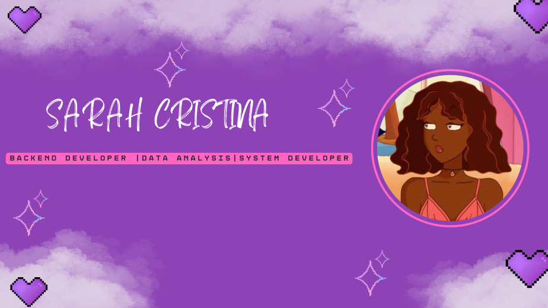

##  
 Olá! meu nome é `Sarah Cristina`, bem vindos ao meu `GitHub` ദ്ദി(˵ •̀ ᴗ - ˵ ) ✧.

  
  

 - 👩🏽‍🎓 Estudante de Sistemas de Informação na Universidade Federal de Juiz de Fora.

 - 💻💞 Apaixonada por tecnologia e fascinada pelo universo dos dados 📊✨.

 - 🌱✨ Interesse em trabalhar na área de dados, com foco em análise e segurança.

 - 📍🌎 Atualmente, moro em Juiz de Fora/MG.

 

## 

<!-- Link para o repositório SudokuSS -->
<a href="https://github.com/SarahCristina00/SudokuSS.git">
  <picture>
    
  </picture>
</a>

<!-- Link para o repositório do jogo Kanoodle -->
<a href="https://github.com/SarahCristina00/Kanoodle">
  <picture>
    
  </picture>
</a>

<!-- Link para o repositório Dashboard Viagem -->
<a href="https://github.com/SarahCristina00/DashboardViagem">
  <picture>
    
  </picture>
</a>

 
  <a href="https://github.com/SarahCristina00?tab=repositories">
    <picture>
      
    </picture>
  </a>

 

## Linguagens em que programo:

 

  
## Outras tecnologias e sistemas que uso no dia a dia:

 

